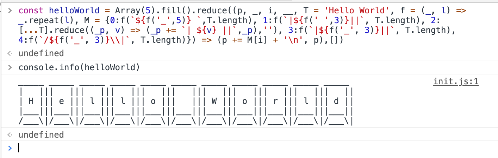

### 1.写作初衷
2017年，当时我还在大二的课堂，机缘巧合下（笑）开始接触到`ECMAScript`（以后的行文就简称js了）这门有趣的、功能丰富的编程语言迄今已有数年了，长时间使用这门语言，心中也诞生了一些感悟、想法、总结与思考，我决定把这些内容联合语法叙述部分以文字的形式记载下来，总结、学习、提升。  
诚如博文项目标题`incredible ecmascript`所言，本项目将聚焦js这门语言本身及其延伸内容。  
内容将会以章节来划分，关联部分会涵盖在内一起娓娓道来，每一章节的对应demo代码会在对应章节的demo_code文件夹下找到。  
如果您在阅读后，能够产生一些思考，那将是我衷心期望的。如果您发现了文章的谬误，恳请您通过issues告知，十分感谢。

### 2.开始吧
依照惯例，学习一门语言应该从`hello world`开始：
```javascript

const helloWorld = Array(5).fill().reduce((p, _, i, __, T = 'Hello World', f = (_, l) => _.repeat(l), M = {0:f(`${f('_',5)} `,T.length), 1:f(`|${f(' ',3)}||`, T.length), 2:[...T].reduce((_p, v) => (_p += `| ${v} ||`,_p),''), 3:f(`|${f('_', 3)}||`, T.length), 4:f(`/${f('_', 3)}\\|`, T.length)}) => (p += M[i] + '\n', p),[])


// 打印 hello world
console.info(helloWorld)

```


### 3.目录
[用上ES6的class，从ES5的面向对象噩梦逃逸出来](./class/main.md)  
[快速上手canvas动画第一期，画一个绚彩螺旋](./canvas/main.md)  
[函数式、命令式迭代方法大演练，一网打尽](./js_loop/main.md)  
[异步编程 Promise](./async/main.md)  
[异步编程 Generator/yield](./async/main.md)  
[异步编程 async/await 串行异步、并发异步控制流](./async/main.md)  
[聊聊 runtime 中的事件循环](./event_loop/main.md)  
[js递归，尾调用，trampoline，记忆化](./recursion/main.md)  
[来！用可爱的js实现一个发布/订阅模式](./subscribe/main.md)  
[上帝方法 reduce、reduceRight，你还能发掘出多少种用法](./reduce/main.md)  
[js对象、原型链详细解析](./prototype_chain/main.md)  
[golang 的协程写起来真的舒适，我们来看看js的协程](./README.md)    
[js 延伸——线程、进程、并发、并行、同步阻塞、异步非阻塞](./README.md)  
[细数 ES6 之前版本（主要ES5.1）的糟粕](./README.md)  
[来看看WeakMap，WeakSet](./README.md)  
[js 中 Iterator](./README.md)  
[js 数据类型判断方法大演练，一网打尽](./README.md)  
[优雅的 react hooks](./README.md)  
[useReducer/useContext 可以替代 redux 吗](./README.md)  
[js 正则玩法花样多](./README.md)  
[实现劫持ajax，hooks注入](./README.md)  
[Object.defineProperty、Proxy 实现 Vue 数据劫持的差异](./README.md)  
[Proxy、Relect api 总结，这就是元编程吗](./README.md)  
[栈，队列，dfs，bfs，老套路了](./README.md)  
[数组原型链高阶函数、原型链普通方法、静态方法总结](./README.md)  
[聊一聊防抖、节流的运用](./README.md)  
[为啥函数式编程范式在业界流行啦](./README.md)  
[来写一个 webpack 插件](./README.md)  
[js 延伸——你必须熟知的 HTTP 协议](./README.md)  
[js 程序员如何了解到更多的服务端开发知识](./README.md)  
[聊聊 base64 转码](./README.md)  
[...](./README.md)  