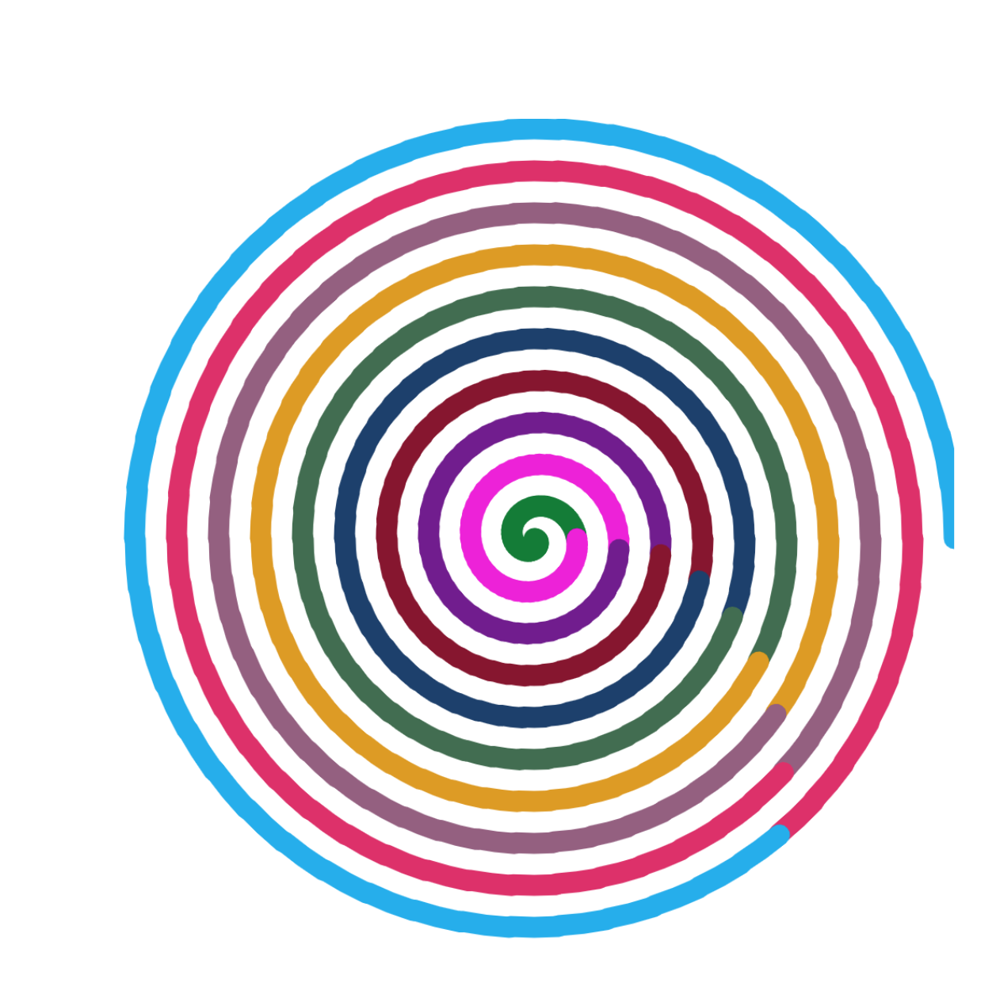

本文是`快速上手canvas动画`系列的第一期，系列每期会做一个动画效果，帮助你快速掌握canvas动画制作。
***
H5的canvas元素为js带来了控制像素的能力，这为前端UI构建带来了更多的想象。本期我们来做做一个简单的动画效果，画一个螺旋图动画。你可以在[这里](./demo_code/vortex.js)获得连贯的代码，并且粘贴到浏览器控制台看看实际运行的的效果。关于canvas的基本概念你可以[参考这里](https://developer.mozilla.org/zh-CN/docs/Web/API/Canvas_API)，本文这次用到的api会在行文中介绍。
```javascript
{

  const length = 1000
  const half = length / 2

  const create = () => {
    const canvas = document.createElement('canvas')
    const style = () => Object.entries({
      // 'pointer-events': 'none',
      width: `${length}px`,
      height: `${length}px`,
      position: 'fixed',
      // background: 'rgba(0,0,0,0.8)',
      top: '200px',
      'z-index': '99999',
      left: `calc(50% - ${half}px)`
    }).reduce((p, [k, v]) => (p += `${k}:${v}!important;`), '')

    canvas.setAttribute('style', style())
      ;['width', 'height'].forEach(attr => canvas.setAttribute(attr, length))
    document.body.appendChild(canvas)

    return canvas.getContext('2d')
  }

  const ctx = create()

  const getColor = () => {
    const r = () => Math.floor(Math.random() * 256) // [0, 255]
    return `rgb(${r()},${r()},${r()})`
  }


  const loop = () => {
    let startAngle = 0 // 初始角度
    let endAngle = 0 // 结束角度
    let before = Date.now() // 更换颜色时间戳
    let radius = 0 // 初始半径
    let color = getColor()

    const count = 10 // 圈数
    const lineCap = 25
    const fullAngle = count * 2 * Math.PI // 一个周期的角度
    const eachItem = fullAngle / half // 每一份角度
    const allTime = (fullAngle / eachItem) * 16.7 // 60帧屏幕刷新率下一个周期总耗时
    const interval = Math.round(allTime / 10) // 每次更换颜色间隔时间

    const core = () => {
      if (endAngle >= fullAngle) return
      ctx.save()
      ctx.beginPath()
      const now = Date.now()
      if (now - before >= interval) {
        before = now
        color = getColor()
      }
      ctx.strokeStyle = color
      ctx.lineCap = 'round'
      ctx.lineWidth = lineCap
      ctx.arc(half, half, radius, startAngle, endAngle)
      ctx.stroke()
      ctx.restore()
      startAngle = endAngle
      endAngle += eachItem
      radius++
      return requestAnimationFrame(core)
    }

    return core()
  }

  loop()

}
```
  
