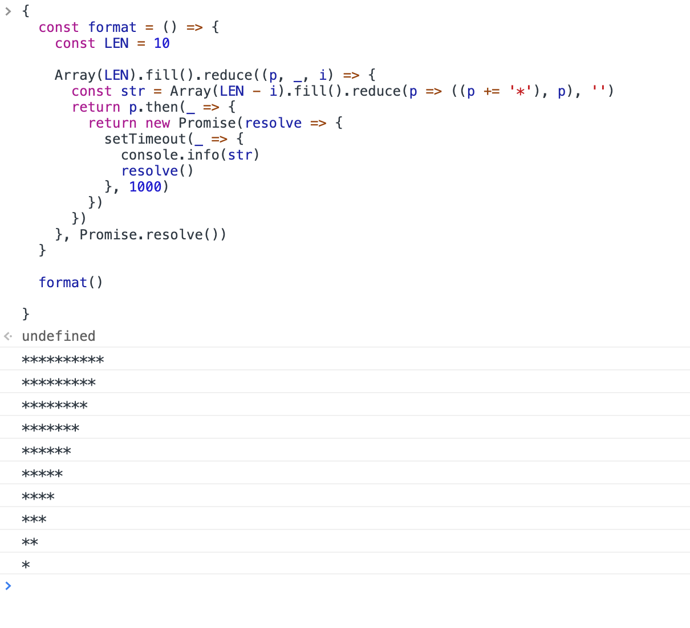

在js中，对于Array、Object、Map、Set、String等数据结构的循环迭代方法有很多种，有的是历史原因遗留下来，有的是作为es.next新特性引入进的，这里就做一个比较全面的归纳总结，需要注意的是，这篇文章并不是在探讨“茴香豆的‘茴’字有多少种方法”，之所以要把这些循环迭代方法拿出来对比展示区别，是因为它们有各自的使用场景，在不同的使用场景下来合理使用它们，可以有效的提升代码的简洁性、可读性。下面我们就开始吧：
- for 循环
  ```javascript

  const array = [1, '2', true, { field: 'demo' }]

  // for循环是js中使用较多的一种循环迭代控制方法
  // 1.它的使用是非常灵活的，我们可以自由的控制其迭代方向、方式
  // 2.如果循环的代码块包裹在函数内，使用return可以终止循环，我们可以使用continue跳过此次循环，使用break跳出循环

  // for (迭代初始执行语句; 满足这里的条件迭代就一直执行（为真）; 每轮迭代都会执行语句) {
  //   迭代内容
  // }


  // 正向迭代
  for (let i = 0; i < array.length; i++) {
    const item = array[i]
  }
  // 反向迭代
  for (let i = array.length - 1; i >= 0; i--) {
    const item = array[i]
  }
  // 同时迭代
  for (let i = 0, j = array.length - 1; i <= j; i++, j--) {
    const itemOfBefore = array[i]
    const itemOfThen = array[j]
  }

  ```
  - [demo_code](./demo_code/for.js)   
- while 循环
  ```javascript

  const array = [1, '2', true, { field: 'demo' }]

  // while循环使用比较简洁
  // 同for循环一样，它使用上是非常灵活的

  // while (满足这里的条件（为真）就执行代码块的内容) {
  //   迭代内容
  // }

  // 正向迭代
  {
    let index = 0
    while (index < array.length) {
      const item = array[index]
      index++
    }
  }
  // 反向迭代
  {
    let index = array.length - 1
    while (index >= 0) {
      const item = array[index]
      index--
    }
  }
  // 同时迭代
  {
    let i = 0
    let j = array.length - 1
    while (i <= j) {
      const itemOfBefore = array[i]
      const itemOfThen = array[j]
      i++
      j--
    }
  }

  ```
  - [demo_code](./demo_code/while.js)   
- do while 循环
  ```javascript

  const array = [1, '2', true, { field: 'demo' }]

  // do while循环的特点和while循环差不多

  let i = 0
  do {
    console.info(array[i])
    i++
  } while (i < array.length)


  // 打印一个 * 三角形

  // **********
  // *********
  // ********
  // *******
  // ******
  // *****
  // ****
  // ***
  // **
  // *

  {
    const LEN = 10
    let i = 0

    do {
     let j = i
     let str = ''
     do {
       str += '*'
       j++
      } while (j < LEN)

     console.info(str)
      i++
    } while (i < LEN)
  }

  ```
  - [demo_code](./demo_code/do_while.js)   
- reduce
  ```javascript

  // reduce控制按序延迟打印 * 三角形
  // 每间隔一秒打印一行

  {
    const format = () => {
      const LEN = 10

      Array(LEN).fill().reduce((p, _, i) => {
        const str = Array(LEN - i).fill().reduce(p => ((p += '*'), p), '')
        return p.then(_ => {
          return new Promise(resolve => {
            setTimeout(_ => {
              console.info(str)
              resolve()
            }, 1000)
          })
        })
      }, Promise.resolve())
    }

    format()
  }

  ```
     
  - [demo_code](./demo_code/reduce.js)  
  - reduce和下面要说的reduceRight方法很是强大，所以我另写了文章来详细地讲解
    - [上帝方法 reduce、reduceRight，你还能发掘出多少种用法](./main.md)
- reduceRight
  ```javascript
  // 与reduce相比，reduceRight是逆序迭代的，其它特性是相同的

  {
    const array = [0, 1, 2, 3, 4, 5, 6, 7, 8, 9]

    array.reduceRight((prev, item, index, thisArray) => {
      console.info(prev, item, index, thisArray)
    })

    array.reduce((prev, item, index, thisArray) => {
      console.info(prev, item, index, thisArray)
    })
  }

  ```
  - [demo_code](./demo_code/reduceRight.js)   
- forEach 循环
  ```javascript
  const array = [1, '2', true, { field: 'demo' }]

  // forEach 是数组原型链上的高阶函数迭代方法
  // break，continue无效
  // return 不能停止循环

  array.forEach((item, index, thisArray) => {
    // item 当前迭代项
    // index 当前下标
    // thisArray 当前迭代的数组
    console.info(item, index, thisArray)
  })

  ```
  - [demo_code](./demo_code/forEach.js)   
- find
  ```javascript
  const array = [1, '2', true, { field: 'demo' }]

  // find 是数组原型链上的高阶函数查找迭代方法，返回的数据是找到的那一项（undefined没有找到）
  // 接受的回调函数参数与forEach相同
  // 一旦找到（return 的值是真值）后就会终止循环迭代

  {
    const finder = array.find((item, index, thisArray) => {
      console.info(item, index, thisArray)
      return index === 1
    })
    console.info(finder)
  }

  ```
  - [demo_code](./demo_code/find.js)   
- findIndex
  ```javascript
  const array = [1, '2', true, { field: 'demo' }]

  // findIndex 是数组原型链上的高阶函数查找迭代方法，返回的数据是找到的那一项索引（-1没有找到）
  // 接受的回调函数参数与forEach相同
  // 一旦找到（return 的值是真值）后就会终止循环迭代

  {
   const findIndex = array.findIndex((item, index, thisArray) => {
     console.info(item, index, thisArray)
     return index === 1
   })
   console.info(findIndex)
  } 

  ```
  - [demo_code](./demo_code/findIndex.js)   
- every
  ```javascript
  const array = [1, '2', true, { field: 'demo' }]

  // every 是数组原型链上的高阶函数迭代方法
  // 返回true，表示回调函数每一轮return都是真值，否则返回false
  // 接受的回调函数参数与forEach相同
  // 一旦有一轮回调函数return的值是假值后就会终止循环迭代

  {
    const is = array.every((item, index, thisArray) => {
      console.info(item, index, thisArray)
      return true
    })
    console.info(is)
  }

  ```
  - [demo_code](./demo_code/every.js)   
- some
  ```javascript
  const array = [1, '2', true, { field: 'demo' }]

  // some 是数组原型链上的高阶函数迭代方法
  // 返回true，表示回调函数有一轮return是真值；如果没有一轮return真值，则返回false
  // 接受的回调函数参数与forEach相同
  // 一旦有一轮回调函数return的值是真值后就会终止循环迭代

  {
    const is = array.some((item, index, thisArray) => {
      console.info(item, index, thisArray)
      return true
    })
    console.info(is)
  }

  ```
  - [demo_code](./demo_code/some.js)   
- Object.getOwnPropertyNames
  ```javascript

  // Object.getOwnPropertyNames 用于遍历对象的键值（自身可或者不可枚举的属性，不包含Symbol值，原型链上的不会遍历），返回一个键值数组

  {
    let symbol = Symbol('symbol_key')
    let obj = {
      a: 'aa 自身可枚举',
      b: 'bb 自身可枚举',
      [symbol]: '自身可枚举 Symbol'
    }
    Object.defineProperties(obj, {
      c: {
        value: 'cc 自身可枚举',
        enumerable: true
      },
      d: {
        value: 'dd 自身不可枚举',
      }
    }) // 设置obj的d属性不可枚举
    Object.setPrototypeOf(obj, { e: 'ee 原型链可枚举' }) // 设置obj的原型


    Object.getOwnPropertyNames(obj).forEach(key => {
      console.info(key, obj[key], key === symbol)
    })
  }

  ```
  - [demo_code](./demo_code/Object.getOwnPropertyNames.js)   
- Object.getOwnPropertySymbols
  ```javascript
  // Object.getOwnPropertySymbols 用于遍历对象的键值（自身可或者不可枚举的Symbol属性，原型链上的不会遍历），返回一个键值数组

  {
    let symbol = Symbol('symbol_key')
    let obj = {
      a: 'aa 自身可枚举',
      b: 'bb 自身可枚举',
      [symbol]: '自身可枚举 Symbol'
    }
    Object.defineProperties(obj, {
      c: {
        value: 'cc 自身可枚举',
        enumerable: true
      },
      d: {
        value: 'dd 自身不可枚举',
      }
    }) // 设置obj的d属性不可枚举
    Object.setPrototypeOf(obj, { e: 'ee 原型链可枚举' }) // 设置obj的原型


    Object.getOwnPropertySymbols(obj).forEach(key => {
      console.info(key, obj[key], key === symbol)
    })
  }

  ```
  - [demo_code](./demo_code/Object.getOwnPropertySymbols.js)   
- Reflect.ownKeys
  ```javascript
  // Reflect 上的一个静态方法，用于遍历对象的键值（自身可或者不可枚举的属性，包含Symbol值，原型链上的不会遍历），返回一个键值数组
  // Object.getOwnPropertyNames、Object.getOwnPropertySymbols 的并集

  {
    let symbol = Symbol('symbol_key')
    let obj = {
      a: 'aa 自身可枚举',
      b: 'bb 自身可枚举',
      [symbol]: '自身可枚举 Symbol'
    }
    Object.defineProperties(obj, {
      c: {
        value: 'cc 自身可枚举',
        enumerable: true
      },
      d: {
       value: 'dd 自身不可枚举',
      }
    }) // 设置obj的d属性不可枚举
    Object.setPrototypeOf(obj, { e: 'ee 原型链可枚举' }) // 设置obj的原型


    Reflect.ownKeys(obj).forEach(key => {
      console.info(key, obj[key], key === symbol)
    })
  }

  ```
  - [demo_code](./demo_code/Reflect.ownKeys.js)   
- Object.keys
  ```javascript
  // Object 对象构造器上的一个静态方法，用于遍历对象的键值（自身可枚举的除去Symbol的属性，原型链上的不会遍历），返回一个由键值组成的数组

  {
    let symbol = Symbol('symbol_key')

    let obj = {
      a: 'aa 自身可枚举',
      b: 'bb 自身可枚举',
      [symbol]: '自身可枚举 symbol'
    }
    Object.defineProperties(obj, {
      c: {
        value: 'cc 自身可枚举',
        enumerable: true
      },
      d: {
        value: 'dd 自身不可枚举',
      }
    }) // 设置obj的d属性不可枚举
    Object.setPrototypeOf(obj, { e: 'ee 原型链可枚举' }) // 设置obj的原型

    Object.keys(obj).forEach(key => {
      console.info(key, obj[key])
    })
  }

  ```
  - [demo_code](./demo_code/Object.keys.js)   
- Object.values
  ```javascript
  // Object 对象构造器上的一个静态方法，用于遍历对象的属性值（自身可枚举的属性，原型链上的不会遍历），返回一个由属性值组成的数组

  {
    let obj = {
      a: 'aa',
      b: 'bb',
    }
    Object.defineProperties(obj, {
      c: {
        value: 'cc',
        enumerable: true
      },
      d: {
        value: 'dd',
      }
    }) // 设置obj的d属性不可枚举
    Object.setPrototypeOf(obj, { e: 'ee' }) // 设置obj的原型

    Object.values(obj).forEach(value => {
      console.info(value)
    })
  }

  ```
  - [demo_code](./demo_code/Object.values.js)   
- Object.entries
  ```javascript
  // Object 对象构造器上的一个静态方法，用于遍历对象的键值、属性值（自身可枚举的属性，原型链上的不会遍历），返回一个由键值、属性值组成的二维数组

  {
    let obj = {
      a: 'aa',
      b: 'bb',
    }
    Object.defineProperties(obj, {
      c: {
        value: 'cc',
        enumerable: true
      },
      d: {
        value: 'dd',
      }
    }) // 设置obj的d属性不可枚举
    Object.setPrototypeOf(obj, { e: 'ee' }) // 设置obj的原型

    const array = Object.entries(obj)

    array.forEach(([key, value]) => {
      console.info(key, value)
    })

    console.info(Object.fromEntries(array))
  }

  // 需要注意的是 Object.fromEntries 可以把这样一种数据结构再转化成对应的对象（逆向操作）

  ```
  - [demo_code](./demo_code/Object.entries.js)   
- map
  ```javascript
  {
    const array = [1, '2', true, { field: 'demo' }]

    // map 是数组原型链上的高阶函数迭代方法，字面上的自已就是“映射”
    // 把一组数组映射为另一组数组
    // break，continue无效
    // return 不能停止循环

    array.map((item, index, thisArray) => {
      // item 当前迭代项
      // index 当前下标
      // thisArray 当前迭代的数组
      console.info(item, index, thisArray)
      return 0
    })

    // 将 [1, '2', true, { field: 'demo' }]
    // 映射为
    // [0, 0, 0, 0]
  }

  ```
  - [demo_code](./demo_code/map.js)   
- filter
  ```javascript
  {
    const array = [1, '2', true, { field: 'demo' }]

    // filter 是数组原型链上的高阶函数迭代方法，字面上的自已就是“过滤”
    // 把回调函数return为真值的项保留下来，为假值的项过滤掉
    // break，continue无效
    // return 不能停止循环

    array.filter((item, index, thisArray) => {
      // item 当前迭代项
      // index 当前下标
      // thisArray 当前迭代的数组
      console.info(item, index, thisArray)
      return index === 2 || index === 3
    })
  }

  ```
  - [demo_code](./demo_code/filter.js)   
- for in 循环
  ```javascript
  // for in循环是js中比较古早的一种迭代方法了，他是专用于遍历对象的一种迭代方法
  // 用于遍历对象自身、原型链上的可枚举属性，可以使用 Object.hasOwnProperty 方法过滤掉原型链上的属性

  {
    let obj = {
      a: 'aa',
      b: 'bb',
    }
    Object.defineProperties(obj, {
      c: {
        value: 'cc',
        enumerable: true
      },
      d: {
        value: 'dd',
      }
    }) // 设置obj的d属性不可枚举
    Object.setPrototypeOf(obj, { e: 'ee' }) // 设置obj的原型

    for (let key in obj) {
      console.info(key, obj[key])
    }
  }

  ```
  - [demo_code](./demo_code/for_in.js)   
- for of 循环
  ```javascript
  // for of迭代是es6新推出的迭代方法，用于定义一个统一的迭代方法
  // 原生数据结构 Map，Set，Array，String，WeakMap，WeakSet，arguments伪数组，nodeList 都已经部署了迭代接口 Symbol.iterator 

  {
    for (let item of [1, 2, 3, 4, 5, 6]) {
      console.info(item)
    }
  }

  // 需要注意的是原始对象默认没有部署迭代接口 Symbol.iterator   

  ```
  - [demo_code](./demo_code/for_of.js)   