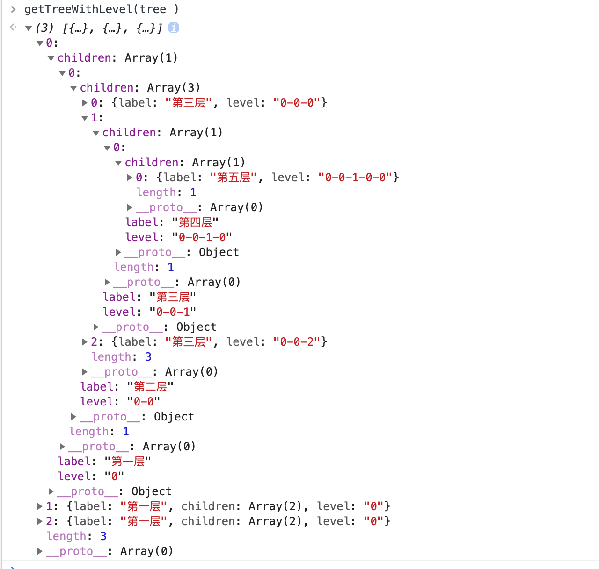
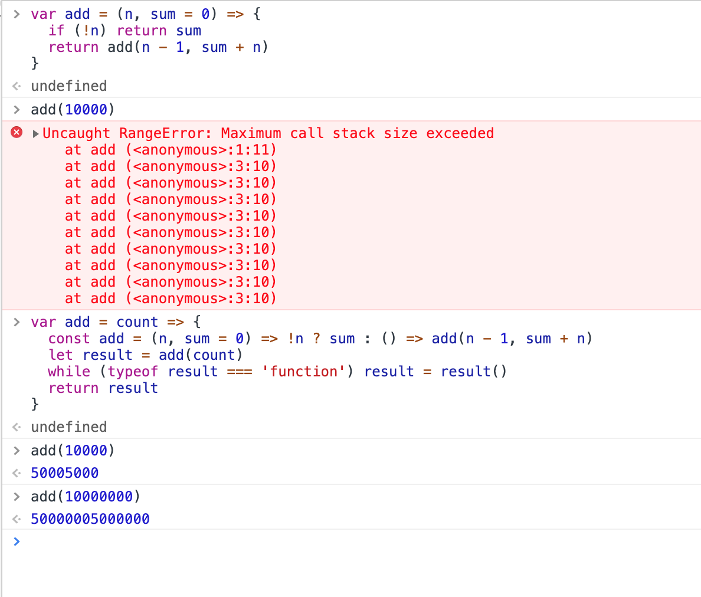

### 什么是递归
简单来说，一个函数fn，在它的函数体内部自己调用自己，就是递归。
```javascript
// 这是一个简单的递归函数，返回从 1 到 n 的累加和

var add = (n, sum = 0) => {
  if (!n) return sum
  return add(n - 1, sum + n)
}

add(10) // 55
```
[demo code](./demo_code/recursion.js)   
### 递归的问题
递归函数层级调用过深、终止递归的条件控制不当会报栈溢出异常。原因是，在执行函数时，会有一个系统的函数调用帧（调用栈）自动帮我们记录每一层的中间临时变量，函数调用位置等数据，如果递归的层级过深，这些数据量就会变得庞大导致栈溢出。
### 尾递归
你可能注意到了，上面的那个add函数，我在其内部递归执行时，会将其return出去，相当于递归时，其函数调用帧是可以复用的，有的JS引擎会将其优化成循环。这种现象我们称之为`尾调用优化`，来看两个例子：
```javascript
/**  
 * 求斐波那契数列第 count 项的值
 */
const fib = count => {
  if (count <= 2) return 1
  const core = (l = 3, n1 = 1, n2 = 1) => {
    if (l > count) return n2
    return core(l + 1, n2, n1 + n2)
  }
  return core()
}

fib(20)
```
[demo code](./demo_code/fibonacci.js)   
```javascript

const getTreeWithLevel = tree => {
  const core = (node, level) => {
    if (Array.isArray(node.children)) {
      return {
        ...node,
        level,
        children: node.children.map((_, i) => core(_, `${level}-${i}`))
      }
    }
    return { ...node, level }
  }
  return tree.map((_, i) => core(_, `0`))
}
// 新生成一颗树，给每一个层级加上层级索引 level
// getTreeWithLevel(tree)
```
[demo code](./demo_code/tree.js)  
   
一方面，在支持尾调用优化的js引擎中，我们把尽量把普通的递归改写成尾调用，更甚一步，改写成循环的形式其实可以避免栈溢出；另一方面，普通的递归不会有那么深的层级。
### 蹦床函数
js是一门支持高阶函数的函数式编程语言，我们可以利用这个特性，来实现一个永不爆栈的递归函数，这种技巧（奇巧淫技）称为`蹦床函数`。来看看最初的求累加和的add递归函数，我们把它改写一下：
```javascript

var add = count => {
  const add = (n, sum = 0) => !n ? sum : () => add(n - 1, sum + n)
  let result = add(count)
  while (typeof result === 'function') result = result()
  return result
}

add(10000)
```
[demo code](./demo_code/trampoline.js)    
  
来看看运行结果，旧add函数在10000栈溢出，而蹦床函数版即使到一千万也都没有栈溢出。实际上利用高阶函数的特性，我们把递归优化成循环了。这个累加的例子当然一开始就应该用循环去写，我这里将它写成递归的形式，纯粹只是为了方便说明。实际上，在真正的纯函数式语言（比如Haskell）中，是没有循环的，递归即是循环，循环即是递归。
