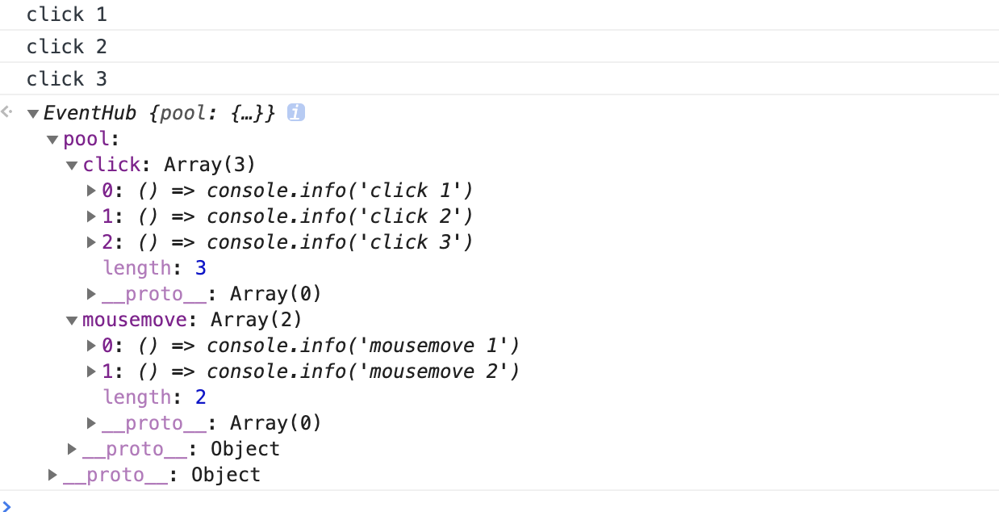

### publish/subscribe 概述
发布/订阅模式是一种使用非常广泛的设计模式，它描述了一种一对多的关系。对于前端开发来说，DOM的事件监听就是一个经典的一对多模式。举个例子，现在有几个用户A、B、C、D在同时浏览一个网页，这个网页上有一个DOM元素a，DOM元素a上面绑定了click、mousemove、mouseenter、mouseleave等多个DOM事件，每个事件也绑定多个监听回调函数。用户们在浏览网页的过程，会触发到这些事件监听函数。  
在这个例子里面，DOM元素a就是一个消息（事件）的发布者，用户A、B、C、D就是消息（事件）的订阅者，订阅者可以对一个或者多个不同类别的消息（不同类型的事件）订阅通知。

### 定义说明
现在再回过头来看看发布/订阅模式的定义：
- 在软件架构中，发布订阅是一种消息范式，消息的发送者（称为发布者）不会将消息直接发送给特定的接收者（称为订阅者）。而是将发布的消息分为不同的类别，无需了解哪些订阅者（如果有的话）可能存在。同样的，订阅者可以表达对一个或多个类别的兴趣，只接收感兴趣的消息，无需了解哪些发布者（如果有的话）存在。
- 优点
  - 松耦合
    - 发布者与订阅者松耦合，甚至不需要知道它们的存在。
  - 可扩展性
    - 发布/订阅提供了比传统的C/S架构更好的可扩展性。 
  
在发布/订阅模式中，发布者与订阅者之前是不会直接对话的，它们之间有一个中间层事件中心EventHub来通信，这样确实做到了比较好的解耦。

### 简单实现实现一个EventHub
[demo_code](./demo_code/event_hub.js)  
```javascript
{
  class EventHub {
    // handler 事件监听函数池
    pool = {}
    // 添加事件监听器
    addEventListener(eventName, handler) {
      // 要验证同一事件的同一监听函数是否重复添加
      if (this.pool[eventName]) {
        const finder = this.pool[eventName].find(handler_ => handler_ === handler)
        if (finder) return this
      } else {
        this.pool[eventName] = []
      }
      this.pool[eventName].push(handler)
      return this
    }
    // 移除事件监听器
    removeEventListener(eventName, handler) {
      if (!this.pool[eventName]) return this
      this.pool[eventName] = this.pool[eventName].filter(handler_ => handler_ !== handler)
      return this
    }
    // 提供事件监听、移除监听的简写方法
    add(...args) {
      return this.addEventListener(...args)
    }
    remove(...args) {
      return this.removeEventListener(...args)
    }
    // 触发某一事件，则该事件对应监听函数池内的函数将会依次被调用
    emit(eventName) {
      if (!this.pool[eventName]) return this
      this.pool[eventName].forEach(handler => handler())
      return this
    }
  }


  const hub = new EventHub() // 事件中心实例
  const click2Handler = () => console.info('click 2')
  const click4Handler = () => console.info('click 4')

  hub
    .add('click', () => console.info('click 1'))
    .add('click', click2Handler)
    .add('click', click2Handler)
    .add('click', () => console.info('click 3'))
    .add('click', click4Handler)
    .remove('click', click4Handler)
    .emit('click')
    .add('mousemove', () => console.info('mousemove 1'))
    .add('mousemove', () => console.info('mousemove 2'))
}

```
来看看运行结果，最后click事件只订阅了click1、click2、click3
